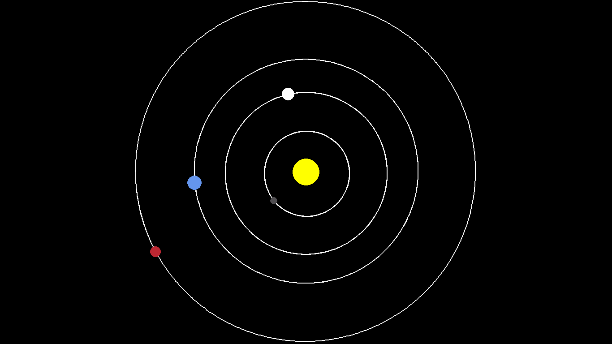

# Planet Simulation using Pygame

This project uses some basic mathematics and physics to make the planets move, Pygame is used for the GUI.

This Project is highly inspired from [Tech With Tim](https://github.com/techwithtim/Python-Planet-Simulation)

I also used the following sources for reference:
<li>https://fiftyexamples.readthedocs.io/en/latest/gravity.html</li>

<li>https://thepythoncodingbook.com/2021/09/29/simulating-orbiting-planets-in-a-solar-system-using-python-orbiting-planets-series-1/</li>

<li>https://research.wdss.io/planetary-motion</li>

## Pictures

